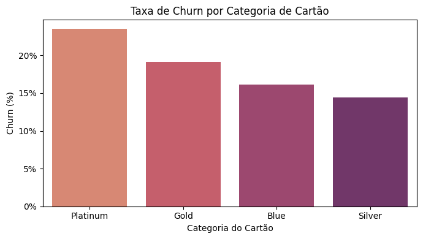

# Predição de Churn de Cartão de Crédito

Este projeto tem como objetivo desenvolver um modelo preditivo para estimar a probabilidade de clientes cancelarem seus cartões de crédito. O cancelamento de clientes (*churn*) é um problema crescente para bancos e operadoras, impactando diretamente indicadores como receita recorrente, valor do tempo de vida do cliente (CLV) e retorno sobre o custo de aquisição (CAC). Antecipar quais clientes têm maior risco de cancelamento permite que a empresa adote ações proativas, oferecendo benefícios, ajustes personalizados ou contato direto para reduzir o churn e melhorar a retenção.  

Os dados utilizados foram obtidos na plataforma Kaggle e incluem informações demográficas, comportamentais, financeiras e de relacionamento com o banco de aproximadamente 10.127 clientes ao longo de seis meses. A variável alvo, *Attrition_Flag*, indica se o cliente cancelou o serviço (1) ou permaneceu ativo (0), sendo que apenas 16,07% dos clientes cancelaram, caracterizando um problema de classificação desbalanceada.  

O projeto segue a metodologia CRISP-DM, contemplando desde a compreensão do problema de negócio, preparação e análise exploratória dos dados, criação de variáveis derivadas, modelagem preditiva até a avaliação dos resultados e geração de insights estratégicos. O objetivo final é fornecer previsões confiáveis que auxiliem a empresa na tomada de decisões e na implementação de medidas que aumentem a retenção de clientes e a sustentabilidade do negócio.

# Ferramentas, Tecnologias e Técnicas Utilizadas no Projeto de Previsão de Churn

## Linguagens de Programação
- **Python** – principal linguagem utilizada para análise de dados, criação de modelos de machine learning, cálculo de métricas e simulações financeiras.  

## Bibliotecas Python
- **Pandas** e **NumPy** – manipulação de dados, cálculos e preparação de datasets.  
- **Matplotlib** e **Seaborn** – visualização de dados e gráficos exploratórios (EDA).  
- **LightGBM** – modelo de classificação utilizado para prever churn, incluindo análise de importância de variáveis (*gain*).  
- **SHAP** – análise interpretativa para entender o impacto de cada variável nas previsões.  
- **Scikit-learn** – métricas de avaliação, pré-processamento e validação cruzada.  

## Ferramentas de Desenvolvimento e Documentação
- **Jupyter Notebook / Google Colab** – desenvolvimento interativo do projeto, com código, visualizações e Markdown.  
- **Markdown** – documentação do projeto e organização de resultados dentro do notebook e README.  
- **Git / GitHub** – versionamento e hospedagem do projeto.  

## Metodologia
- **CRISP-DM** – estrutura utilizada para guiar todas as etapas do projeto: compreensão do negócio, preparação de dados, análise exploratória, modelagem, avaliação de performance e interpretação dos resultados.  

## Técnicas Utilizadas

### 1. Exploração e Análise de Dados (EDA)
- Estatísticas descritivas (média, mediana, desvio padrão).  
- Visualizações gráficas: histogramas, boxplots, gráficos de barras e heatmaps de correlação.  
- Comparação de churn entre diferentes perfis de clientes (demográficos, transacionais e comportamentais).

### 2. Pré-processamento de Dados
- Tratamento de valores ausentes.  
- Codificação de variáveis categóricas (one-hot e label encoding).  
- Criação de variáveis derivadas (ex.: `delta_uso`, mudanças trimestrais de transações e valores).  
- Balanceamento de classes para lidar com desbalanceamento (16,07% de churn).

### 3. Modelagem de Machine Learning
- Classificação supervisionada com **LightGBM**.  
- Validação de modelo: divisão treino/teste e métricas de performance (recall, precision, F1-score, AUC-ROC).  
- Seleção de variáveis mais importantes com *gain* e análise de SHAP para interpretação.

### 4. Análise Financeira e Cenários
- Simulação de ganhos e custos com base em performance do modelo.  
- Cálculo de clientes salvos, receita preservada, custo de campanhas, lucro líquido e ROI.  
- Sensibilidade ao custo de ação, eficácia de retenção e recall.  
- Comparação do modelo com targeting aleatório e projeção para escalabilidade em grandes bases de clientes.  
- Indicadores de controle: EV por cliente, custo médio, percentual de desperdício e elasticidade financeira.

# Problema do Negócio e Objetivos do Projeto

## Problema do Negócio
O cancelamento de clientes (churn) é um desafio crítico para empresas de cartão de crédito, pois impacta diretamente a receita recorrente, o valor do tempo de vida do cliente (CLV) e o retorno sobre o custo de aquisição (CAC). Muitos clientes estão encerrando suas contas, reduzindo a base ativa e aumentando o risco financeiro da empresa.  

Identificar antecipadamente quais clientes têm maior probabilidade de cancelar permite ao banco agir de forma proativa, oferecendo incentivos personalizados, ajustes de limites de crédito ou pacotes de produtos que aumentem o engajamento e a retenção. Sem uma previsão eficaz, as ações de retenção podem ser genéricas, menos eficientes e mais caras.

## Objetivos do Projeto
Este projeto tem como objetivo desenvolver um **modelo preditivo de churn** capaz de estimar a probabilidade de um cliente cancelar o serviço de cartão de crédito. O foco é:

- **Prever clientes com alto risco de churn**, priorizando ações de retenção.  
- **Gerar insights sobre os fatores que influenciam o cancelamento**, como comportamento transacional, engajamento e relacionamento com o banco.  
- **Auxiliar a tomada de decisão estratégica**, permitindo que campanhas de retenção sejam direcionadas, eficientes e financeiramente vantajosas.  
- **Fornecer análises financeiras e projeções** para mensurar o impacto monetário das ações de retenção, avaliando lucro líquido, ROI e sensibilidade a custos e eficácia das campanhas.  

Ao final, o projeto busca transformar dados em ações concretas, reduzindo o churn, aumentando a receita e fortalecendo o relacionamento com os clientes.

# Benefícios do Projeto e Pipeline de Solução

## Benefícios do Projeto
O desenvolvimento de um modelo preditivo de churn oferece uma série de vantagens estratégicas e financeiras para a empresa de cartão de crédito:

1. **Redução de Perdas Financeiras:**  
   Antecipar clientes com alto risco de cancelamento permite implementar ações de retenção direcionadas, preservando receita anual significativa e reduzindo perdas relacionadas a churn.

2. **Otimização de Custos de Marketing e Retenção:**  
   Com a previsão do risco de churn, as campanhas de retenção podem ser direcionadas apenas aos clientes que realmente necessitam de intervenção, aumentando a eficiência e diminuindo gastos desnecessários.

3. **Tomada de Decisão Baseada em Dados:**  
   Insights sobre comportamento transacional, engajamento e relacionamento com o banco permitem decisões estratégicas mais embasadas, como ajustes de limites de crédito, ofertas personalizadas e cross-sell de produtos.

4. **Aumento da Retenção e do Lifetime Value (CLV):**  
   A retenção de clientes de alto valor contribui para aumentar o CLV médio, fortalecendo a base de clientes e garantindo receita recorrente de longo prazo.

5. **Monitoramento Contínuo e Proatividade:**  
   A análise de sinais de alerta em tempo real possibilita ações preventivas, reduzindo churn antes que ocorra e promovendo maior engajamento do cliente.

6. **Suporte à Estratégia de Crescimento:**  
   Clientes engajados são mais propensos a adquirir produtos adicionais e a se tornarem defensores da marca, ampliando o potencial de receita futura.

---

## Pipeline de Solução
O projeto segue uma abordagem estruturada, baseada na metodologia CRISP-DM, integrando análise de dados, modelagem preditiva e avaliação financeira:

1. **Compreensão do Negócio:**  
   - Entendimento do problema de churn e impacto financeiro.  
   - Definição de objetivos estratégicos e métricas de sucesso.

2. **Coleta e Integração de Dados:**  
   - Extração de dados demográficos, financeiros e transacionais dos clientes.  
   - Integração de múltiplas fontes para consolidar o dataset.

3. **Análise Exploratória de Dados (EDA):**  
   - Estatísticas descritivas e visualizações para entender padrões e outliers.  
   - Identificação de relações entre variáveis e churn.

4. **Pré-processamento e Engenharia de Features:**  
   - Tratamento de valores ausentes e inconsistências.  
   - Codificação de variáveis categóricas, normalização e padronização.  
   - Criação de variáveis derivadas, como delta de uso e mudanças trimestrais.  
   - Balanceamento da variável alvo (churn) para melhorar performance do modelo.

5. **Modelagem Preditiva:**  
   - Treinamento de modelos de classificação (LightGBM) para prever churn.  
   - Validação cruzada e otimização de hiperparâmetros.  
   - Avaliação de métricas de performance (recall, precision, F1-score, AUC-ROC).

6. **Interpretação e Insights:**  
   - Análise de importância de variáveis (*gain* e SHAP).  
   - Identificação de fatores críticos que influenciam o churn.  
   - Segmentação de clientes de alto risco.

7. **Avaliação Financeira:**  
   - Simulação de cenários de retenção considerando custo, eficácia e receita preservada.  
   - Cálculo de ROI, lucro líquido, lift financeiro e break-even.  
   - Análise de sensibilidade e projeção para escalabilidade.

8. **Implementação e Monitoramento:**  
   - Integração do modelo em processos de marketing e CRM.  
   - Monitoramento contínuo do churn, eficácia das campanhas e ajustes periódicos.  
   - Dashboards e indicadores de controle para suporte à decisão.

---

**Resumo:**  
Este pipeline garante que o projeto não apenas forneça previsões precisas, mas também traduza os resultados em ações estratégicas e financeiramente mensuráveis, alinhando ciência de dados com objetivos de negócio e resultados tangíveis.

---

# Análises de BoxPlots das Variáveis

A imagem apresenta uma série de **diagramas de caixa (boxplots)** que ilustram a distribuição de diversas variáveis quantitativas.  
A análise se concentra em quatro pilares principais: **Tendência Central**, **Dispersão**, **Simetria** e **Outliers**.

---

##  Tendência Central e Dispersão (Mediana e IQR)

A **Mediana** (linha dentro da caixa) e o **Intervalo Interquartil (IQR)** (comprimento da caixa) variam significativamente entre as variáveis:

- **Baixa Dispersão:**  
  Variáveis como a **primeira** e a **nona** (de cima para baixo) apresentam caixas extremamente estreitas, indicando que **50% dos dados estão concentrados em uma faixa de valores muito pequena**.

- **Alta Dispersão:**  
  Outras variáveis — como a **terceira** e aquelas da **metade inferior** — exibem caixas mais longas, sinalizando **maior variabilidade** nos 50% centrais dos dados.

- **Variáveis Codificadas ou Binárias:**  
  Algumas caixas são **minúsculas** e/ou têm a **Mediana muito próxima de um dos limites**, sugerindo que podem representar **features binárias (0/1)** ou **categóricas codificadas** com predominância de um valor.

---

##  Simetria e Assimetria (Skewness)

A posição da **Mediana** dentro da caixa e o comprimento dos **bigodes (whiskers)** revelam a forma da distribuição:

- **Assimetria Positiva (Skewed Right)** — *Forma mais predominante:*  
  A Mediana está frequentemente próxima do **Primeiro Quartil (Q1)**, com o **bigode superior** mais longo.  
  Isso indica que a **cauda da distribuição se estende para valores mais altos**.

- **Distribuições Quase Simétricas:**  
  Algumas variáveis apresentam a Mediana **centralizada** na caixa e **bigodes equilibrados**, sugerindo **distribuições mais balanceadas** (e.g., a **sétima variável**, na metade superior).

---

##  Presença e Distribuição de Outliers

Os **pontos individuais fora dos bigodes** representam **outliers**, e estão presentes em quase todas as variáveis — uma das **características mais marcantes** do dataset.

- **Outliers Unilaterais (Assimetria Reforçada):**  
  Na maioria das variáveis com **assimetria positiva**, os outliers aparecem **acima do bigode superior**, reforçando a tendência de valores extremos altos.

- **Variáveis Fortemente Contaminadas:**  
  Algumas variáveis (e.g., a **terceira horizontal**) exibem **alta concentração de outliers em ambas as extremidades**, indicando dados **altamente dispersos ou ruidosos**.

- **Outliers Discretos e Extremos:**  
  Em certos casos, os outliers se **estendem por uma ampla faixa no eixo**, revelando **grande variabilidade** mesmo fora do intervalo interquartil.

---

###  Conclusão

A análise dos boxplots demonstra um conjunto de dados com **forte heterogeneidade**, **assimetria positiva predominante** e **presença significativa de outliers**.  
Essas características exigem **cuidadoso pré-processamento** antes da modelagem, incluindo possíveis **transformações de escala** e **tratamento de valores extremos**, para garantir resultados estatísticos e preditivos mais robustos.

---

# Análise da Distribuição da Variável Alvo — Churn


Esta análise apresenta a **distribuição da variável alvo (Churn Flag)**, essencial para compreender o comportamento do conjunto de dados antes da modelagem preditiva.

---

##  Distribuição de Clientes

| Categoria | Contagem | Percentual |
| :--- | ---: | ---: |
| **Não Cancelou (0)** | 6.799 | **83.93%** |
| **Cancelou (1)** | 1.302 | **16.07%** |
| **Total** | 8.101 | 100.00% |

O gráfico de barras evidencia um **forte desbalanceamento de classes**, onde apenas **16% dos clientes cancelaram** o serviço.

---

##  Implicações para a Modelagem

O desbalanceamento impacta diretamente a qualidade dos modelos de *machine learning*:

- **Viés do modelo:** tende a prever majoritariamente “Não Cancelou”.
- **Alta taxa de falsos negativos:** dificuldade em identificar clientes que realmente cancelam.
- **Métricas tradicionais (acurácia)** tornam-se pouco informativas.  
  Métricas recomendadas:
  - **Recall** (para capturar a classe minoritária)  
  - **Precision**, **F1-Score** e **ROC AUC**

---

##  Estratégias de Correção

Para lidar com o desequilíbrio da variável alvo, podem ser aplicadas técnicas como:

- **Oversampling (e.g., SMOTE)** — gerar novas amostras sintéticas da classe *Churn*.  
- **Undersampling** — reduzir amostras da classe majoritária.  
- **Ajuste de pesos** — dar maior importância à classe minoritária nos algoritmos (*class_weight*).  
- **Combinação híbrida** — unir over e undersampling para melhor equilíbrio.

---

###  Conclusão

O dataset apresenta um **problema clássico de classificação desbalanceada**, o que torna a **previsão de churn desafiadora**.  
Abordagens adequadas de **balanceamento e avaliação de métricas** serão fundamentais para alcançar um modelo com real poder preditivo.

---

# Análise — Distribuição do Nível de Educação (`education_level`)


O gráfico apresenta a distribuição dos níveis educacionais no conjunto de dados, destacando as categorias mais representativas e suas implicações para o projeto de *Machine Learning*.

---

###  Principais Resultados

A distribuição concentra-se em três categorias principais, que juntas representam mais de **65%** dos dados:

- **Graduate (30,6%)** — categoria majoritária.  
- **High School (20,4%)** — segunda mais frequente.  
- **Unknown (14,9%)** — terceira mais comum, exigindo tratamento específico.

As categorias **Uneducated (14,6%)** e **College (9,8%)** possuem presença intermediária, enquanto **Post-Graduate (5,3%)** e **Doctorate (4,4%)** são minoritárias.

---

###  Implicações Analíticas

1. **Tratamento de valores "Unknown":** Deve ser imputado ou mantido como categoria própria, pois pode conter informação preditiva.  
2. **Agrupamento de classes raras:** *Post-Graduate* e *Doctorate* podem ser combinadas em uma categoria “Advanced Degrees” para melhorar o aprendizado do modelo.  
3. **Foco nas classes majoritárias:** As análises e segmentações iniciais devem priorizar *Graduate* e *High School*, que representam o perfil predominante dos clientes.

---

Em síntese, o dataset apresenta um público com predominância de formação **média e superior**, mas com **lacunas relevantes de informação educacional**, fator que deve ser cuidadosamente tratado nas etapas de modelagem.

---

# Análise — Distribuição do Estado Civil (`marital_status`)


O gráfico exibe a distribuição dos clientes por estado civil, destacando as categorias mais representativas e as implicações para o tratamento dos dados.

---

###  Principais Resultados

A variável apresenta **alta concentração** em duas categorias, que juntas somam **85,2%** dos clientes:

- **Married (46,4%)** — categoria majoritária.  
- **Single (38,8%)** — segunda mais frequente.  

As categorias minoritárias são:  
- **Unknown (7,5%)**  
- **Divorced (7,4%)**

Essas duas últimas possuem proporções semelhantes e representam uma pequena parcela da base.

---

###  Implicações Analíticas

1. **Tratamento da categoria "Unknown":**  
   - Pode ser mantida como uma categoria própria durante a codificação (*One-Hot Encoding*), pois a ausência de informação pode ter valor preditivo.  
   - Alternativamente, pode ser imputada com a moda (*Married*), se houver justificativa sólida.  

2. **Impacto na Modelagem:**  
   - As classes **Divorced** e **Unknown** terão menor influência no treinamento do modelo devido à sua baixa representatividade.  
   - A modelagem deve priorizar a correta diferenciação entre **Married** e **Single**, que dominam a amostra.

---

Em síntese, o estado civil dos clientes é predominantemente **Casado ou Solteiro**, enquanto os dados *Unknown* exigem atenção especial durante o pré-processamento para evitar viés no modelo.

---

# Análise — Distribuição da Categoria de Renda (`income_category`)


O gráfico apresenta a distribuição dos clientes por faixas de renda, destacando a predominância das classes de **renda baixa e média**.

---

###  Perfil de Renda dos Clientes

A base é dominada por clientes com **renda abaixo de \$80K**, que representam cerca de **67%** do total:

- **Less than \$40K:** 35,0% (classe majoritária)  
- **\$40K – 60K:** 17,9%  
- **\$60K – 80K:** 14,0%  

As faixas de **renda alta** e **dados ausentes** têm menor presença:

- **\$120K +:** 7,3% (classe minoritária)  
- **Unknown:** 10,9% (dados faltantes significativos)

---

###  Implicações Analíticas

1. **Viés de Aprendizado:**  
   O modelo de *Machine Learning* aprenderá padrões dominantes das faixas de **renda baixa e média**, com pouca representatividade das classes mais altas.

2. **Tratamento da Categoria “Unknown”:**  
   Deve ser mantida como categoria própria durante a codificação, pois a ausência de informação pode conter valor preditivo relevante.

3. **Ajuste de Categorias:**  
   Para lidar com o baixo volume da faixa **\$120K +**, pode-se agrupá-la com **\$80K – 120K** em uma categoria única (“\$80K +”), fortalecendo o aprendizado sobre clientes de renda mais alta.

---

Em resumo, o conjunto de dados reflete uma base **majoritariamente de classe média-baixa**, o que requer atenção ao balanceamento e à representação das faixas superiores e dos dados desconhecidos na modelagem.

---

# Análise — Distribuição da Categoria do Cartão (`card_category`)


O gráfico apresenta a distribuição dos clientes entre quatro categorias de cartão: **Blue**, **Silver**, **Gold** e **Platinum**.

---

###  Concentração e Desequilíbrio

Há um **desequilíbrio extremo** na variável:

| Categoria | Percentual |
| :--- | :--- |
| **Blue** | **93.3%** |
| **Silver** | **5.3%** |
| **Gold** | **1.2%** |
| **Platinum** | **0.2%** |

A categoria **Blue** domina amplamente a base de clientes, enquanto as categorias de maior valor (**Silver, Gold e Platinum**) somam apenas **6.7%**.

---

###  Implicações Analíticas e de Negócio

1. **Modelagem Preditiva:**  
   O forte desequilíbrio torna a variável pouco informativa para modelos de *Machine Learning*. As classes minoritárias terão pouca representatividade, aumentando o risco de *overfitting*.

2. **Pré-processamento:**  
   Recomenda-se **agrupar** as categorias *Silver*, *Gold* e *Platinum* em uma única categoria (“**Premium**” ou “**Outras**”) para aumentar a robustez estatística.

3. **Estratégia de Produto:**  
   A predominância do cartão **Blue** indica uma base centrada em produtos de entrada, revelando potencial para **estratégias de *upgrade*** e **fidelização** de clientes para níveis superiores.

---

Em síntese, a variável **card_category** apresenta valor informativo limitado devido ao domínio da categoria **Blue**, exigindo tratamento cuidadoso e agrupamento estratégico para uso efetivo em análises e modelagem preditiva.

---

# Análise — Relação entre Categoria do Cartão (`card_category`) e Churn


O gráfico de barras agrupadas mostra a distribuição das categorias de cartão (**Blue**, **Silver**, **Gold** e **Platinum**) segmentadas pela variável alvo **Churn Flag** (*Cancelou* vs *Não Cancelou*), permitindo avaliar o poder preditivo da *feature*.

---

###  1. Domínio da Categoria “Blue”

A categoria **Blue** domina amplamente o dataset e concentra a maior parte dos cancelamentos em termos absolutos.  
Entretanto, proporcionalmente, o **risco de churn** entre clientes *Blue* é **baixo**, já que a maioria permanece ativa.

---

###  2. Categorias Premium (Silver, Gold e Platinum)

* **Silver e Gold:** Apesar de representarem menor volume, exibem **maior proporção de churn** dentro de suas categorias, sugerindo **risco relativo mais alto** de cancelamento.  
* **Platinum:** Amostra muito pequena para conclusões confiáveis — pode refletir **baixo risco real** ou **limitação de dados**.

---

###  3. Conclusão e Implicações

* **Poder Preditivo:** A variável `card_category` tem **relevância preditiva** — especialmente para distinguir clientes de maior valor (Silver e Gold) com risco elevado de churn.  
* **Ação Estratégica:** As categorias *Silver* e *Gold* devem ser **prioridade em estratégias de retenção**, pois combinam **alto valor** e **maior propensão ao cancelamento**.  
* **Próximo Passo:** Calcular a **taxa percentual de churn** por categoria para confirmar o risco relativo.

---

Em resumo, embora o *Blue* concentre o maior número absoluto de cancelamentos, o **risco proporcional** é maior em *Silver* e *Gold*, tornando estas categorias cruciais para a tomada de decisão analítica e estratégica.

---

# Análise do Nível de Educação por Churn


O gráfico de barras agrupadas compara o número de clientes que **Cancelaram** e **Não Cancelaram** o serviço, segmentados pelo **Nível de Educação**. Essa análise busca entender se o nível educacional influencia a probabilidade de *Churn*.

### Principais Insights

- **Proporção de Cancelamentos:** A relação entre clientes que cancelaram e não cancelaram é **semelhante em todas as categorias educacionais**, indicando que o nível de educação **não é um fator preditivo relevante** para o *Churn*.
- **Volume de Clientes:** As categorias **Graduate** e **High School** concentram o maior número absoluto de cancelamentos, mas isso se deve ao maior número de clientes nessas faixas — não a um risco maior.
- **Categorias Menores:** Grupos como **Post-Graduate** e **Doctorate** apresentam volumes reduzidos, dificultando conclusões estatísticas.
- **Categoria “Unknown”:** O comportamento segue o mesmo padrão das demais, sugerindo que a ausência dessa informação **não aumenta o risco de cancelamento**.

### Conclusão

O **nível de educação** mostra **baixo poder preditivo** para explicar o *Churn*. Estratégias de retenção devem se concentrar em outras variáveis com maior influência sobre o cancelamento.

---

# Análise do Estado Civil por Churn


O gráfico de barras agrupadas compara clientes que **Cancelaram** e **Não Cancelaram**, segmentados pelo **Estado Civil**, para avaliar se esta variável influencia o risco de *Churn*.

### Principais Insights

- **Proporção de Cancelamentos:** As categorias **Married** e **Single** apresentam maior número absoluto de cancelamentos, mas a proporção entre *Churn* e *Não Churn* é **similar em todas as categorias**.
- **Categorias Menores (Divorced e Unknown):** Seguem o mesmo padrão proporcional, indicando que a falta de informação ou o estado civil específico **não aumentam significativamente o risco de cancelamento**.
- **Baixo Poder Preditivo:** O estado civil individual **não é um preditor relevante** de *Churn*.

### Conclusão

A variável **marital_status** deve ser codificada para modelos, mas **não é uma feature crítica** para distinguir clientes que cancelam daqueles que permanecem ativos.

---

# Análise da Categoria de Renda por Churn


O gráfico de barras agrupadas compara clientes que **Cancelaram** e **Não Cancelaram**, segmentados por **faixa de renda**, para avaliar o risco de *Churn*.

### Principais Insights

- **Risco Proporcional Uniforme:** As taxas de *Churn* são relativamente consistentes em todas as faixas de renda, incluindo **Renda Alta** e **Renda Desconhecida (Unknown)**.
- **Volume Absoluto vs. Risco Relativo:** Embora a faixa **"Less than $40K"** apresente o maior número absoluto de cancelamentos, sua **taxa relativa de Churn** não é maior que as demais.
- **Baixo Poder Preditivo:** A variável **income_category** sozinha **não é um bom preditor** de cancelamento.

### Conclusão

A renda deve ser codificada para o modelo, mas não é esperada como uma feature crítica na distinção entre clientes que cancelam e os que permanecem ativos.

---

# Análise Integrada de Pairplot e Boxplots para Churn


O estudo combina **Pairplot** (relações bivariadas com Churn) e **Boxplots** (distribuição univariada) para entender padrões de risco e orientar a modelagem preditiva.

---

### 1. Insights do Pairplot (Variáveis mais Correlacionadas ao Churn)

- **Variáveis-chave:** `delta_uso`, `total_trans_ct`, `total_ct_chnng_q4_q1`, `total_revolving_bal`.
- **Padrão de Churn:** Clientes com **baixo engajamento e baixo saldo rotativo** têm maior probabilidade de cancelar.
- **Distribuições Univariadas:** Classe *Churn* concentrada em valores baixos; classe *Não Churn* distribuída em valores maiores.
- **Mudança no Uso (`total_ct_chnng_q4_q1`):** Baixo crescimento de uso é um fator de risco, mas menos discriminatório que volume absoluto ou saldo.

---

### 2. Insights dos Boxplots (Distribuição Univariada)

- **Assimetria Positiva:** Maioria das variáveis com skewed right; transformaçãos logarítmicas ou de raiz quadrada recomendadas.
- **Outliers:** Presentes em quase todas as variáveis; tratamento robusto necessário (winsorizing ou modelos não paramétricos).
- **Variáveis discretas/binárias:** Algumas caixas muito estreitas indicam baixa variação ou natureza binária.

---

### 3. Conclusão Integrada e Estratégia de Modelagem

1. **Fatores Preditivos Principais:** Baixo saldo rotativo e baixo número de transações são os melhores indicadores de Churn.
2. **Pré-Processamento Necessário:**
   - Transformação de assimetria (`log(x)`).
   - Tratamento de outliers (*winsorizing*).
   - Balanceamento de classes (*SMOTE* ou ajuste de peso).
3. **Seleção de Modelo:** Modelos baseados em árvore (*Random Forest*, *Gradient Boosting*) são recomendados devido a separação não-linear e robustez contra outliers.

---

# Análise de Boxplots e PCA para Churn


Esta análise combina **Boxplots** (distribuição univariada) e **PCA** (redução de dimensionalidade) para entender padrões de risco e separabilidade das classes de Churn.

---

### 1. Insights dos Boxplots

- **Assimetria Positiva:** A maioria das variáveis contínuas é *skewed right*, com a mediana próxima ao Q1 e cauda superior longa.
  - Implica necessidade de **transformações** (log, Box-Cox) para normalização.
- **Baixa Dispersão:** Algumas variáveis têm caixas estreitas, indicando valores concentrados.
- **Outliers Generalizados:** Presentes em quase todas as variáveis; exigem **tratamento robusto** (winsorizing ou clipping) para não distorcer modelos.

---

### 2. Insights do PCA

- **Desbalanceamento de Classes:** Clientes *Não Churn* predominam; *Churn* é minoritário.
- **Baixa Separação:** Clientes que cancelaram estão amplamente misturados aos que não cancelaram.
  - PCA (PC1 e PC2) não é suficiente para separar as classes.
  - O Churn é **complexo e não linearmente separável**.
- **Tendência de Churn:** Leve concentração de clientes que cancelaram em **baixo PC2** e PC1 negativo, indicando variáveis mais relevantes.

---

### 3. Conclusão Integrada

1. **Pré-Processamento Necessário:**
   - Transformação de assimetria (log/Box-Cox)
   - Tratamento de outliers
2. **Desafio de Modelagem:** Alta sobreposição de classes indica que modelos simples ou clusterização não supervisionada não serão eficazes.
3. **Estratégia Recomendada:**
   - **Algoritmos robustos**: Gradient Boosting, Deep Learning
   - **Engenharia de features**: Criar interações ou métricas derivadas para aumentar a separabilidade entre *Churn* e *Não Churn*.

---

# Análise Integrada de Churn: Variável Alvo, Boxplots e Mapa de Calor


Esta análise combina a distribuição da variável alvo, as características das variáveis contínuas e a análise multivariada de risco para identificar padrões e segmentos críticos de *Churn*.

---

### 1. Variável Alvo (Churn Flag)

- **Desbalanceamento extremo:**  
  - Não Cancelou: 6.799 clientes (83.93%)  
  - Cancelou: 1.302 clientes (16.07%)  
- **Implicação:** Métricas como **acurácia** são enganosas; usar **Recall, Precision, F1-Score e ROC AUC** para avaliar a classe minoritária.  
- **Pré-processamento obrigatório:** Técnicas de balanceamento (SMOTE ou ajuste de peso).

---

### 2. Variáveis Contínuas (Boxplots)

- **Assimetria Positiva:** Mediana próxima a Q1, cauda superior longa.  
  - Transformações sugeridas: $\log(x)$ ou $\sqrt{x)$.  
- **Outliers generalizados:** Presentes na maioria das variáveis; requerem tratamento (*Winsorizing*, clipping) ou modelos robustos (Árvores de Decisão).  
- **Baixa Variação:** Algumas variáveis têm IQR muito estreito, indicando pouca diversidade entre clientes.

---

### 3. Análise Multivariada de Risco (Mapa de Calor)

- **Segmentos de alto risco:**

| Segmento | Taxa de Churn | Observação |
| :--- | :--- | :--- |
| Unknown (Gold) | 33.33% | Risco máximo; falta de dados indica possível desengajamento. |
| Married (Platinum) | 28.57% | Risco extremo; custo de perda alto. |
| Single (Platinum) | 25.00% | Risco elevado; foco em retenção prioritária. |

- **Insights estratégicos:**
  1. **Produtos premium** (Gold e Platinum) apresentam Churn significativamente maior que a média.
  2. **Falta de dados (Unknown)** é um preditor relevante; tratar como categoria separada.
  3. **Base Blue:** Apesar de taxa próxima à média, o volume absoluto de Churn é alto; estratégias de retenção devem focar em escala.

---

**Conclusão:** O risco de Churn é conduzido principalmente por **qualidade dos dados** e **categoria do produto**. O pré-processamento deve lidar com **assimetria**, **outliers** e **desbalanceamento de classes** para otimizar a modelagem preditiva.

---

# Análise Integrada de Churn: Idade, Produto e Perfil do Cliente


Esta análise combina insights de risco de *Churn* com perfil demográfico e produto para orientar estratégias de retenção e modelagem preditiva.

---

### 1. Variável Alvo (Churn Flag)

- **Desbalanceamento extremo:**  
  - Não Cancelou: 6.799 clientes (83.93%)  
  - Cancelou: 1.302 clientes (16.07%)  
- **Implicação:** Usar **Recall, ROC AUC** e técnicas de balanceamento (SMOTE ou ajuste de peso); Acurácia é enganosa.

---

### 2. Risco de Churn por Faixa Etária

- **Maior risco:** 41-50 anos e 51-60 anos (~17%).  
- **Menor risco:** 18-30 anos (~9.7%).  
- **Idosos (60+):** Risco moderado (~12.9%).  
- **Conclusão:** Priorizar retenção de clientes de meia-idade.

---

### 3. Categoria do Produto (card_category)

- **Domínio do Blue:** Maior volume absoluto de cancelamentos.  
- **Risco proporcional mais alto:** Silver e Gold; clientes premium são mais propensos a cancelar.  
- **Ação:** Estratégias de retenção focadas em clientes de alto valor.

---

### 4. Perfil Demográfico e Educacional

- **Renda:** Dominância da faixa < \$40K (35%) e "Unknown" (10.9%) — tratar como categoria separada.  
- **Educação:** Graduate (30.6%) e High School (20.4%), "Unknown" (14.9%) deve ser codificado separadamente.  
- **Estado Civil:** Casados (46.4%) e Solteiros (38.8%), "Unknown" relevante (7.5%).

---

### 5. Variáveis Contínuas (Boxplots)

- **Assimetria positiva:** Mediana próxima ao Q1 em quase todas as variáveis.  
- **Outliers:** Numerosos na extremidade superior.  
- **Pré-processamento:** Transformações ($\log(x)$) e tratamento de outliers (*Winsorizing*) necessários.

---

### Sumário e Estratégia de Modelagem

1. **Foco de Retenção:** Clientes de meia-idade (41-60) e portadores de cartões premium (Silver e Gold).  
2. **Categorias "Unknown":** Manter como *features* separadas; podem ser preditoras de *Churn*.  
3. **Modelagem:** Devido a desbalanceamento e assimetria, usar modelos robustos como **Gradient Boosting (XGBoost/LightGBM)** em vez de modelos lineares.

---

# Análise da Taxa de Churn por Categoria de Cartão


O gráfico apresenta a **taxa de *Churn* (%)** por categoria de cartão: Platinum, Gold, Blue e Silver, destacando o **risco relativo** de cancelamento.

---

### 1. Risco de Churn por Categoria

| Categoria | Taxa de Churn | Risco Relativo |
| :--- | :--- | :--- |
| **Platinum** | ~22.0% | Máximo |
| **Gold** | ~19.0% | Alto |
| **Blue** | ~16.0% | Médio |
| **Silver** | ~14.5% | Mínimo |

---

### 2. Conclusões Estratégicas

- **Produtos Premium (Platinum e Gold):**  
  - Maior taxa de *Churn*, acima da média geral (16.07%).  
  - Clientes mais valiosos, porém mais propensos a cancelar proporcionalmente.  
  - Sugere necessidade de melhorias na proposta de valor, benefícios ou serviço.

- **Categoria Silver:**  
  - Menor taxa de *Churn* (~14.5%), indicando maior estabilidade.  
  - Serve como referência para estratégias de retenção.

- **Categoria Blue:**  
  - Taxa próxima à média (~16%).  
  - Retenção deve focar em **volume e automação**; ações para premium devem ser **personalizadas**.

---

### 3. Implicação para Modelagem Preditiva

- **Categoria do Cartão** é um **forte preditor de *Churn***.  
- Modelos devem prestar atenção especial aos segmentos **Platinum** e **Gold**, pois o impacto do *Churn* nesses grupos é crítico para o negócio.

---

# Principais Variáveis e Implicações


As **cinco variáveis mais importantes** são:

1. **total_trans_ct** (Contagem Total de Transações): Fator mais crucial, indicando que a **frequência de transações** é determinante para a previsão (ex.: *Churn* ou risco de crédito).  
2. **total_trans_amt** (Valor Total de Transações): Complementa a frequência, mostrando que o **volume de gasto** é altamente preditivo.  
3. **total_revolving_bal** (Saldo Rotativo Total): Reflete o **nível de endividamento**, sendo chave para avaliar risco financeiro.  
4. **total_relationship_count** (Contagem Total de Relacionamentos): Indica o **engajamento e profundidade do relacionamento** do cliente com o banco.  
5. **total_amt_chng_q4_q1** (Mudança no Valor Total Q4 vs Q1): Métrica de **comportamento temporal**, mostrando variações importantes no gasto do cliente.

---

## Observações Adicionais

* **Comportamento vs. Demografia:** Variáveis de **uso e comportamento** (transações, saldos, mudanças ao longo do tempo) dominam a importância. Variáveis **demográficas ou estáticas** (idade, gênero, renda, estado civil) têm *gain* baixo.  
* **Baixa Relevância:** Algumas features (`income_category__60K__80K`, `utilizacao_relativa`, `marital_status_Married`, `gender_0`, `avg_utilization_ratio`) contribuem pouco ou nada para a previsão.  

**Conclusão:** O modelo LightGBM mostra que **atividade transacional e utilização de crédito rotativo** são os principais impulsionadores da capacidade preditiva, enquanto características demográficas têm impacto secundário.

---

# Interpretação do Gráfico SHAP Sumary plot


* **Eixo Y:** Variáveis ordenadas por importância.  
* **Eixo X:** Valor SHAP (impacto na previsão).  
  * Positivo → aumenta a previsão do modelo.  
  * Negativo → diminui a previsão do modelo.  
* **Cor:** Representa o valor da variável.  
  * Vermelho → valor alto.  
  * Azul → valor baixo.

---

## Principais Insights

### 1. Variáveis de Comportamento

* **total_trans_ct (Contagem Total de Transações):**  
  * Baixa contagem (azul, direita) → aumenta probabilidade de *churn*.  
  * Alta contagem (vermelho, esquerda) → diminui probabilidade de *churn*.  

* **total_trans_amt (Valor Total de Transações):**  
  * Baixo gasto → aumenta previsão de *churn*.  
  * Alto gasto → diminui previsão.  

* **total_revolving_bal (Saldo Rotativo Total):**  
  * Alto saldo (vermelho, direita) → aumenta previsão (maior risco).  
  * Baixo saldo (azul, esquerda) → diminui previsão.

### 2. Variáveis Dinâmicas

* **total_amt_chng_q4_q1 (Mudança no Valor Total Q4 vs Q1):**  
  * Queda no gasto (azul, direita) → aumenta probabilidade de *churn*.  
  * Aumento no gasto (vermelho, esquerda) → diminui probabilidade.

### 3. Variáveis de Efeito Misto

* **months_inactive_12_mon (Meses Inativos 12M):**  
  * Valores altos (vermelho) → tendência a aumentar previsão de *churn*.  
  * Valores baixos → menor impacto, efeito misto.

---

**Conclusão:** O gráfico SHAP confirma que **atividade e engajamento do cliente** (transações e saldo) são os principais fatores de risco, enquanto quedas no gasto e períodos de inatividade são sinais fortes de *churn*.

---

# Análise de Resultados do Modelo e Avaliação Financeira — Previsão de Churn

Este relatório resume **insights de modelo (LightGBM) e impactos financeiros** para retenção de clientes.

---

## 1. Principais Variáveis (LightGBM – Gain)

As variáveis mais importantes são **comportamentais**, não demográficas:

- **Top 5:** `total_trans_ct`, `total_trans_amt`, `total_revolving_bal`, `total_relationship_count`, `total_amt_chng_q4_q1`.  
- **Médias:** idade, meses inativos, limite de crédito.  
- **Menores:** gênero, estado civil, dependentes, renda.

**Insight:** O churn é explicado principalmente pelo **comportamento transacional e engajamento**, pouco pelas características demográficas.

---

## 2. SHAP Values — Impacto nas Previsões

- **Transações baixas (`total_trans_ct`) →** aumento do risco de churn.  
- **Baixo gasto (`total_trans_amt`) →** maior probabilidade de churn.  
- **Saldo rotativo (`total_revolving_bal`) →** níveis intermediários aumentam churn.  
- **Queda no uso (`delta_uso`, mudanças trimestrais) →** indicativo forte de churn.  
- **Mais produtos (`total_relationship_count`) →** reduz churn.  
- **Meses inativos →** quanto mais, maior o risco.

> Conclusão: **Engajamento e uso do produto** dominam a previsão; demografia tem peso baixo.

---

## 3. Insights e Recomendações de Negócio

1. **Frequência de transações:** Incentivar uso via cashback, pontos, alertas automáticos.  
2. **Valor transacionado:** Ofertas personalizadas, aumento de limite, promoções baseadas no histórico.  
3. **Queda de uso:** Alertas e ações proativas de retenção.  
4. **Relacionamento múltiplo:** Estratégias de *cross-sell* e pacotes fidelização.  
5. **Inatividade prolongada:** Programas de reativação, notificações personalizadas.  
6. **Baixo impacto demográfico:** Foco em comportamento, não segmentações tradicionais.

> Estratégia central: **monitoramento em tempo real + ações proativas de retenção personalizadas**.

---

## 4. Avaliação Financeira — Cenário Base

- **Clientes analisados:** 10.127  
- **Taxa de churn histórica:** 16,07% → 1.627 clientes  
- **ARPA:** R\$ 3.000/ano  
- **Custo ação de retenção:** R\$ 100  
- **Modelo:** recall 90%, precision 87%  
- **Eficácia ação:** 50%

**Resultados 1 ano:**

| Métrica | Valor |
|---------|------:|
| Clientes salvos | 732 |
| Receita preservada | R\$ 2.197.002 |
| Custo total | R\$ 168.353 |
| Lucro líquido | R\$ 2.028.649 |
| ROI | 12,05× |

**Custo por cliente salvo:** R\$ 229,89  
**EV médio por cliente alvo:** R\$ 1.205  

---

## 5. Sensibilidade

- **Variação custo por ação (R\$ 50–200) e ret_eff (30–70%)** mantém projeto viável.  
- **Aumento de recall** aumenta clientes salvos, mas reduz precision → deve-se otimizar lucro líquido.  
- **Break-even:** Retenção mínima para não prejuízo é baixa (≈ 2–8%).

---

## 6. Modelo vs Aleatório

| Estratégia | Net (lucro) |
|------------|------------:|
| Modelo LGBM | R\$ 2.028.649 |
| Aleatório | R\$ 237.461 |

> **Lift financeiro:** ≈ 8,5×.

---

## 7. Escalabilidade (200.000 clientes)

- Clientes salvos: ≈ 14.463  
- Receita preservada: R\$ 43,39M  
- Custo campanhas: R\$ 3,32M  
- Lucro líquido: R\$ 40,06M  
- NPV 3 anos (desconto 10%): ≈ R\$ 101M

---

## 8. Principais KPIs para Dashboard

- EV médio por cliente alvo: R\$ 1.205  
- Custo médio por cliente salvo: R\$ 229,89  
- Percentual de desperdício (FP): ≈ 13%  
- Perda anual por FN: R\$ 488.223  

---

## 9. Riscos e Monitoramento

- Eficácia da ação (ret_eff) é sensível → usar A/B tests  
- Monitorar ARPA e churn pós-campanha  
- Ajustar trade-off recall × precision baseado em lucro líquido

---

## 10. Fórmulas Básicas (Apêndice)

```text
P = N × p
TP = recall × P
FP = TP × (1/precision − 1)
T = TP + FP
Salvos = TP × ret_eff
Revenue_saved = Salvos × ARPA
Cost_total = T × cost_ret
Net = Revenue_saved − Cost_total
ROI = Net / Cost_total
EV_por_alvo = precision × ret_eff × ARPA − cost_ret
Ret_eff_break_even = (1 / precision) × (cost_ret / ARPA)
NPV_multi_ano = Salvos × PV(ARPA, discount, years) − Cost_total

